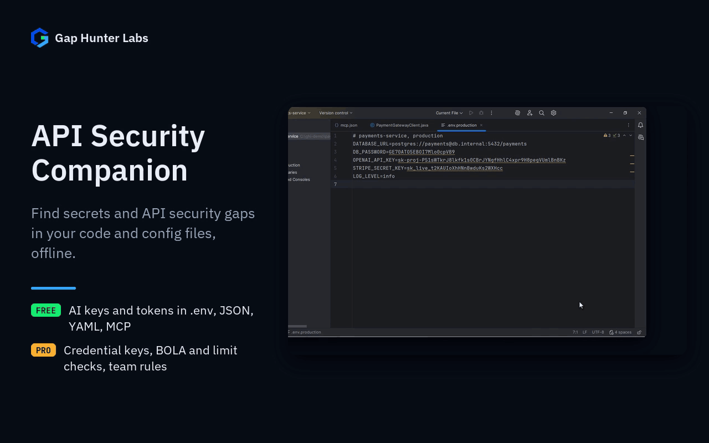

# API Security Companion

IntelliJ/Android Studio plugin. Lightweight, 100% local API-security
checks for Java and Kotlin — hardcoded secrets, plaintext HTTP, TLS
misconfiguration, and OWASP API Security Top 10 patterns.



Each feature on its own:
[AI keys in .env files](docs/media/01-ai-keys.gif) ·
[Secrets in MCP configs](docs/media/02-mcp-configs.gif) ·
[Credential-named keys](docs/media/03-credential-keys.gif) ·
[Checks in your code](docs/media/04-code-checks.gif)

## Why it exists

Built after reviewing real, recent reviews of the market-leading security
scanners, not assumptions:

- **Snyk Security** (759K downloads, 85% ≤3★): recurring 2024-2026 reports
  of IDE freezes and crashes during scans ("Freezes Rider on scans. Have
  to kill process in TaskManager"), broken suppression/ignore logic, and
  background processes flagged by antivirus software.
- **Qodana Security Analysis** (JetBrains' own, 88% ≤3★): the "Taint
  Analysis" button is disabled out of the box with no clear way to enable
  it, and using it at all turns out to require a $180/year "Ultimate
  Plus" subscription that isn't disclosed until checkout.
- **OpenAPI Specifications** (JetBrains' own, 8M downloads, 70% ≤3★):
  "catastrophically slow... turned into torture" editing/rendering
  OpenAPI documents, IDE hangs even on small 10-15-endpoint files.

None of these are financially beatable — they're free or backed by
well-funded vendors. The gap isn't "cheaper than Snyk," it's "actually
works, never freezes the IDE, and never phones home."

## What it checks

- **Hardcoded secrets**: AWS access keys, GitHub/Slack tokens, Stripe
  secret/restricted keys, JWTs, PEM private key blocks, plus a
  variable-name + Shannon-entropy heuristic for the generic case
  (`val apiSecret = "..."` with a high-entropy value that isn't an
  obvious placeholder).
- **Secrets in configuration files**, not only in Java/Kotlin literals:
  known-format tokens in JSON, YAML, `.properties` and `.env` files
  (`.env.local`, `.env.production`, ...), including the MCP server configs
  that AI tools read (`mcp.json`, `.cursor/mcp.json`, `.vscode/mcp.json`,
  `claude_desktop_config.json`), where API keys end up pasted into `env`
  and `headers`. Formats covered, in code and in config: OpenAI, Anthropic,
  Hugging Face, Groq, Perplexity, Google API keys, GitHub (classic and
  fine-grained), GitLab, npm, PyPI, SendGrid, Shopify, DigitalOcean,
  Databricks, HashiCorp Vault, Slack tokens and webhook URLs, Stripe, AWS,
  JWTs and PEM private keys. Each is a fixed prefix plus a fixed-length body,
  so a match is a near-certain finding. Template files (`.env.example`,
  `*.sample`, `*.template`), lock files, build directories and anything
  under an `example`/`description` key are skipped, and a reference such as
  `${OPENAI_API_KEY}` is never reported.
- **Plaintext HTTP** to non-local hosts.
- **TLS trust managers that accept every certificate** (CWE-295) —
  the classic empty `checkServerTrusted`/`checkClientTrusted`.
- **Excessive Data Exposure / Mass Assignment** (OWASP API Security Top
  10, Java and Kotlin): REST endpoints that return a persistence entity
  directly, or bind a request body straight onto one.
- **OpenAPI spec checks**: an empty top-level `security:` scheme, and
  wildcard CORS (`Access-Control-Allow-Origin: *`) combined with
  `Access-Control-Allow-Credentials: true`.

## Why built this way

- **No network calls, no cloud dashboard.** Every check runs in-process
  against the code already open in the editor. This is the direct fix
  for Snyk's auth failures, mystery background processes, and the
  general enterprise concern about sending source code to a third-party
  cloud for scanning.
- **Every rule is a normal `Annotator`**, which the platform's own
  highlighting daemon already schedules during its background pass —
  not on the UI thread. This is the direct fix for the "freezes the IDE
  during scans" complaint common to Snyk and to JetBrains' own OpenAPI
  Specifications plugin.
- **Every rule can be disabled individually**, with no exceptions — the
  direct fix for Qodana's Taint Analysis being un-disableable and
  undisclosed-paywalled at the same time.
- **Pure-Kotlin detection logic, separated from PSI walking** (see
  `detect/`), so every rule's exact matching behavior is unit-tested
  without needing to spin up the platform.
- **No YAML/JSON parser dependency** for the OpenAPI checks — targeted
  line-based regexes are enough for "does this key exist with this
  value," and a full spec parser is exactly the kind of heavyweight
  approach that made the OpenAPI Specifications plugin slow in the first
  place.

## API Security Companion Pro

Optional paid tier on top of everything above (all free-tier checks stay
free, no exceptions):

- **Kotlin support for Excessive Data Exposure / Mass Assignment** — the
  free tier's checks are Java-only; Pro resolves Kotlin type references
  (including a Kotlin function referencing a Java-declared entity class)
  to catch the same two OWASP checks in Kotlin code.
- **Broken Object Level Authorization** (OWASP API1): flags a REST
  endpoint with an object-ID-shaped parameter (`id`, `orderId`, `user_id`)
  and no visible authorization/ownership check in its body. A heuristic
  — always framed as "potential," worth a manual look, not a certainty.
- **Unrestricted Resource Consumption** (OWASP API4): flags a page-size/
  limit-shaped parameter with no upper-bound validation annotation.
- **Credential-named keys in configuration files**: a key whose last word
  is a credential noun (`client_secret`, `DB_PASSWORD`, `Authorization`,
  `--api-key=...`) with a high-entropy value, in the same file types as
  above. Stricter than the Java-literal heuristic on purpose:
  `token_url` and `secretName` are settings *about* a secret, so the
  credential word has to be the key's last word, and URLs, paths,
  sentences, slugs and references are never treated as values. Known
  formats stay free.
- **Team rules shared via VCS**: commit a `.gaphunter-security-rules`
  file (one rule ID per line, `#` for comments) to your project root,
  and every rule listed there is enforced for every team member who
  opens the project — a rule the team agreed on can't be silently
  disabled by one person's local Settings.
- **ML false-positive reduction on generic secret matches** (off by
  default, even with a license — enable it from Settings): a small
  model (under 20KB, no network calls, no telemetry) re-checks the
  generic, entropy-based secret match before it's shown, to cut down
  on warnings for UUIDs, hashes, and other high-entropy-but-not-secret
  values. It never touches a recognized format like an AWS key or a
  JWT — those are already exact matches. Tuned deliberately
  conservative: it only suppresses a warning when confident, because
  missing a real secret is a far worse outcome than one extra warning.

## Buying for a team

Pro licenses, for one developer or a whole team, are sold only through
JetBrains Marketplace: open the [Pricing tab](https://plugins.jetbrains.com/plugin/33195-api-security-companion/pricing) on the plugin's
page. JetBrains Marketplace handles checkout and license management.

## Support

- **Bugs and feature requests:** [GitHub Issues](https://github.com/GapHunterLabs/api-security-companion/issues)
- **Questions, or custom rules for a team's codebase:** **gaphunterlabs@gmail.com**
- **Security vulnerabilities:** report privately as described in [SECURITY.md](SECURITY.md), not in a public issue.
- **Privacy and network behavior:** [PRIVACY.md](PRIVACY.md)

## Development

```
./gradlew test           # unit tests
./gradlew buildPlugin     # generates build/distributions/*.zip
./gradlew verifyPlugin    # checks compatibility against real IDEs
```

## License

The source code is licensed under the Apache License 2.0. See `LICENSE`.

The plugin published on JetBrains Marketplace is distributed under the [Gap Hunter Labs End User License Agreement](https://gaphunterlabs.github.io/eula/) ([Spanish](https://gaphunterlabs.github.io/es/eula/)). The EULA covers the paid license for the Pro features (bought on JetBrains Marketplace), warranty, liability, and support. It does not restrict any right the Apache License gives you over the source code.
